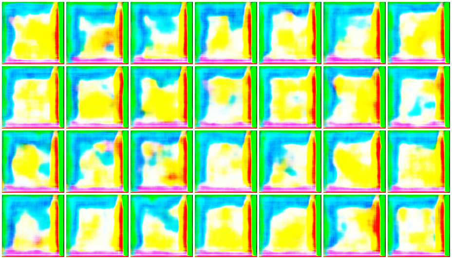
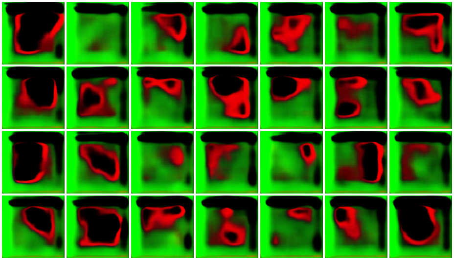
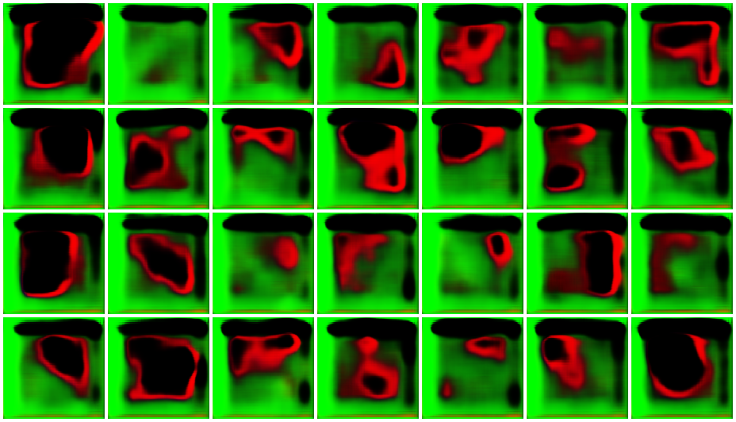

## GAN implementation

I started off with a simple GAN to get the basics, I feed it with paintings from `Frida_Kahlo` which I resize to 128x128.

The problem is that from the 299 training the generated images are the same (see bellow).

From there I googled that this is a common problem `mode collapse` and the recommendation was to switch to something like `WGAN` or further extensions of it.

99th

--
199th

--
299th

